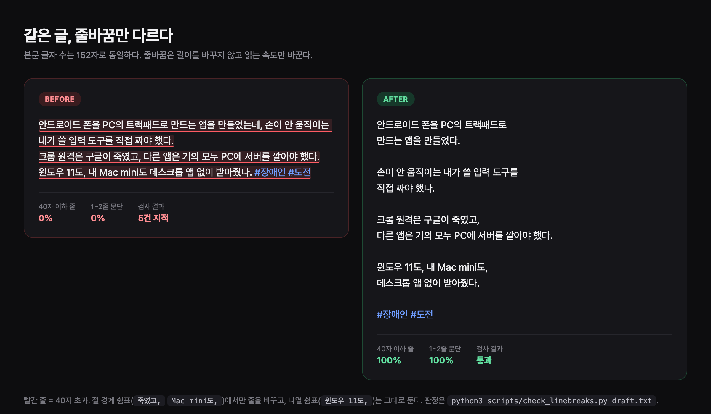

# threads-writing-skills

Threads(스레드) 글쓰기용 에이전트 스킬 모음. **Claude Code와 Codex 양쪽에서 같은 파일로 동작한다.**

규칙은 감이 아니라 실측이다. [@yong_____jjang](https://www.threads.com/@yong_____jjang) 계정의 공식 Threads API 리포트 4개월치(2026-04~07)에서 본문 캡션과 자답글 **397건**을 뽑아 줄 단위로 집계했다.



같은 152자다. 줄바꿈은 글자 수를 바꾸지 않는다. 바꾸는 건 읽는 속도다.

---

## 들어 있는 스킬

| 스킬 | 하는 일 |
|---|---|
| [`threads-linebreak`](threads-linebreak/) | Threads 글의 줄바꿈·문단을 실측 패턴대로 다듬고, 위반을 검사 스크립트로 잡아낸다 |

---

## 규칙 요약

> **연결어미 뒤 쉼표에서 줄바꿈 1번.**
> **문단이 끝나면 줄바꿈 2번(빈 줄 1개).**

- 모든 쉼표에서 바꾸지 않는다 — 줄 끝에 오는 쉼표는 실측 **44%**뿐이다. 나머지는 숫자·나열이라 그대로 둔다
- 줄 길이 평균 **25자**, **40자 이하가 86%**
- 문단은 **1~2줄이 76%**. 3줄을 넘기면 쪼갤 자리를 찾는다
- 줄의 **절반은 마침표로 끝난다**. 쉼표 줄바꿈은 양념이지 기본이 아니다

자세한 근거와 예시는 [`threads-linebreak/SKILL.md`](threads-linebreak/SKILL.md)에 있다.

---

## 검사 스크립트

```bash
python3 threads-linebreak/scripts/check_linebreaks.py draft.txt
```

의존성 없다(Python 3.8+). 규칙 위반은 `고칠 것`으로, 판단이 필요한 쉼표는 `확인해볼 것`으로 나눠 보고한다 — 절 경계인지 나열인지는 문맥을 봐야 아는 일이라 결정은 사람에게 남긴다.

```
── 분포 ──
문단 5개 · 줄 8개 · 본문 153자(줄바꿈 제외)
줄 길이 평균 19.1자 · 40자 이하 100% (실측 기준 86%)
문단 1~2줄 비율 100% (실측 기준 76%) · 구성 [2, 2, 2, 1, 1]

── 고칠 것 없음 ──
```

`--json`을 붙이면 기계가 읽는 형식으로 나온다. 위반이 있으면 종료 코드 1을 반환하므로 CI나 발행 전 훅에 걸 수 있다.

---

## 설치

```bash
git clone https://github.com/Tygb99/threads-writing-skills.git
cd threads-writing-skills
./install.sh
```

`install.sh`는 저장소를 지우지 않고 **심볼릭 링크만** 건다:

- **Claude Code** → `~/.claude/skills/threads-linebreak`
- **Codex** → `~/.codex/AGENTS.md`에 스킬 경로 한 줄 추가

이후 `git pull` 한 번이면 양쪽 다 갱신된다.

수동으로 하려면 스킬 폴더를 각 도구가 읽는 위치에 복사하거나 링크하면 된다. `SKILL.md` 형식(YAML frontmatter + 마크다운)은 두 도구가 동일하게 쓴다.

---

## 라이선스

MIT. 자기 계정 데이터로 숫자를 다시 뽑아 쓰는 것을 권한다 — 이 수치는 한 계정의 글 397건에서 나온 것이라, 문체가 다르면 분포도 다르다.
