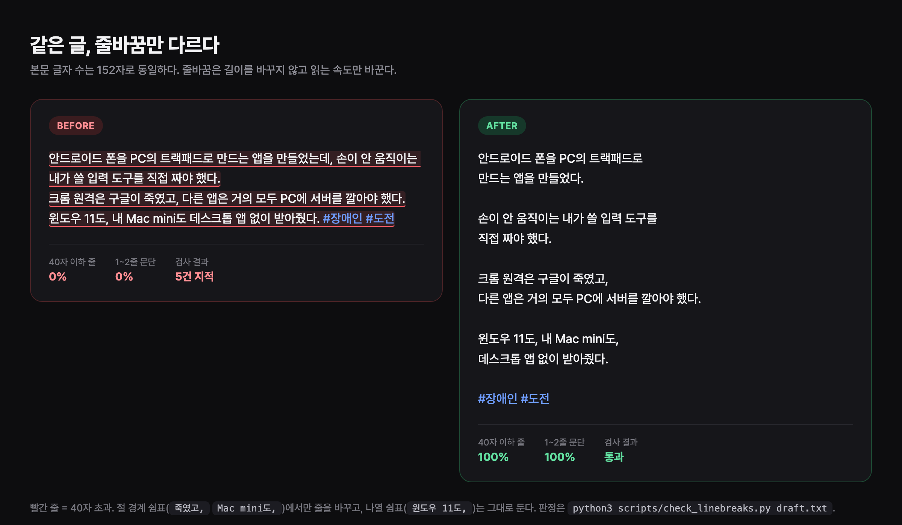

# threads-writing-skills

규칙은 감이 아니라 측정값이다. Threads 공식 API 리포트 4개월치에서 캡션과 자답글 397건을 줄 단위로 집계해 만든 한국어 글쓰기 스킬 모음이다. Claude Code·Codex 플러그인으로 배포하며 Aside용 설치 스크립트도 제공한다.



양쪽 다 152자이며, 줄바꿈은 길이가 아니라 읽는 속도를 바꾼다.

## 스킬

| 스킬 | 설명 |
|---|---|
| [`threads-linebreak`](skills/threads-linebreak/) | 한국어 Threads 줄바꿈을 다듬고 초안을 검사한다 |
| [`threads-web-publish`](skills/threads-web-publish/) | Aside로 Threads 글을 발행·예약·수정·복구한다 |
| [`alt-text-generator`](skills/alt-text-generator/) | 한국어 alt를 짧게 만들고 plain text와 HTML로 출력한다 |
| [`threads-brand-card`](skills/threads-brand-card/) | 재현 가능한 HTML·CSS로 브랜드 카드를 만든다 |
| [`threads-html-image`](skills/threads-html-image/) | 글자·수치·스크린샷을 PNG로 렌더한다 |

### `threads-web-publish` 참고 문서

| 문서 | 설명 |
|---|---|
| `composing.md` | 글·답글·미디어 첨부 작성 |
| `scheduling.md` | 글 예약과 예약 초안 찾기 |
| `recovery.md` | 발행 글 수정과 실수 복구 |
| `dm-source.md` | DM 대화를 발화자와 함께 글 소재로 정리 |

## 규칙 요약

- 한 줄 목표는 25자, 상한은 40자다
- 문단은 4줄 이하로 유지한다
- 절을 끝내는 쉼표에서 줄을 바꾸고, 나열·숫자 쉼표는 붙여 둔다
- 문장 끝 마침표는 생략하고 URL·수치·버전·파일명의 점은 보존한다
- 해시태그는 기본 0개다

## 검사기

```bash
python3 skills/threads-linebreak/scripts/check_linebreaks.py draft.txt
```

출력 예:

```
── 분포 ──
문단 2개 · 줄 3개 · 본문 50자(줄바꿈 제외)
줄 길이 평균 16.7자 · 40자 이하 100% (현재 기준)
문단 1~2줄 비율 100% (권장) · 구성 [2, 1]
줄 끝 쉼표 33% (절 경계인지 확인)
줄 끝 문자 {',': 1, '다': 1, '간': 1}

── 고칠 것 없음 ──
```

기계 처리 형식은 `--json`을 붙인다. Python 3.8+ 표준 라이브러리만 사용하며 위반이 있으면 종료 코드 1을 반환한다.

### Jev 판정 (`--jev`, 실험)

1.1.0에서 추가했다. 두 검사기(`check_linebreaks.py`, `check_first_paragraph.py`)에 `--jev`를 붙이면 사람에게 넘기던 판정을 Jev에게 먼저 묻는다. Jev는 TypeSafe의 System One 모델이고 Vercel AI Gateway(`typesafe-ai/jev`)로 호출한다.

```bash
AI_GATEWAY_API_KEY=... python3 skills/threads-linebreak/scripts/check_linebreaks.py draft.txt --jev
AI_GATEWAY_API_KEY=... python3 skills/threads-linebreak/scripts/check_first_paragraph.py draft.txt --jev
```

- 줄바꿈 검사기는 쉼표마다 절 경계인지 나열인지 판정하고, 실제 줄 위치와 어긋난 것만 confidence 순으로 보여 준다
- 첫 문단 검사기는 주어 유형(사건형·작업물형·기타)과 첫 줄 미완결 확률을 덧붙인다
- 환경변수 `AI_GATEWAY_API_KEY`가 필요하다. 없으면 종료 코드 2다. 호출이 실패하면 규칙 기반 판정으로 대체하고 이유를 stderr에 남긴다
- `--jev`를 붙이지 않으면 이전과 똑같이 외부 호출 없이 돈다. `--jev`를 붙이면 검사할 문단이 Vercel AI Gateway로 전송된다
- 실측(2026-09-22): 사람 라벨 46개 기준 정확도 89.1%, confidence 0.7 이상만 추리면 96.8%다. 표본이 작아 참고치로 본다
- Jev 값은 볼 순서를 정할 뿐이다. 최종 판단은 사람이 한다

## 설치

### Claude Code 플러그인

```text
/plugin marketplace add Tygb99/threads-writing-skills
/plugin install threads-writing-skills@threads-writing-skills
/reload-plugins
```

필요하면 `/reload-plugins` 대신 재시작하고 `claude plugin list`로 확인한다. 스킬 호출명에는 네임스페이스가 붙어 `/threads-writing-skills:threads-linebreak`처럼 쓴다.

### Codex 플러그인

```bash
codex plugin marketplace add Tygb99/threads-writing-skills
codex plugin add threads-writing-skills@threads-writing-skills
codex plugin list
```

제거는 `codex plugin remove`와 `codex plugin marketplace remove`를 사용한다(필요한 인자는 각 명령의 `--help`로 확인한다). Codex는 마켓플레이스 카탈로그로 `.claude-plugin/marketplace.json`을 읽고 플러그인 매니페스트로 `.codex-plugin/plugin.json`을 읽는다.

### Aside·omo와 수동 체크아웃 설치

Aside에는 플러그인 시스템이 없다. omo처럼 공용 스킬 폴더를 읽는 에이전트도 이 방법으로 설치한다. 저장소를 복제하고 실행한다:

```bash
git clone https://github.com/Tygb99/threads-writing-skills.git
cd threads-writing-skills
./install.sh
```

스크립트는 네 곳에 스킬별 심링크를 걸어 체크아웃을 개발 중에 바로 쓸 수 있게 한다.

| 대상 | 경로 | 바꾸는 환경변수 |
|---|---|---|
| Aside | `~/.aside/u/0/skills/user` | `ASIDE_SKILLS_DIR` |
| Claude Code | `~/.claude/skills` | `CLAUDE_SKILLS_DIR` |
| Codex | `~/.codex/skills` | `CODEX_SKILLS_DIR` |
| 공용 폴더 | `~/.agents/skills` | `AGENTS_SKILLS_DIR` |

공용 폴더 `~/.agents/skills`는 Agent Skills 표준 위치다. omo, Codex, Cursor, OpenCode, Pi가 이 폴더를 읽는다(2026-09-27 각 공식 문서와 omo·Codex 실행으로 확인). Claude Code와 Aside는 자기 폴더만 읽어서 따로 건다. Codex 0.157.0은 `~/.codex/skills`와 `~/.agents/skills`에 같은 스킬이 있어도 한 번만 보여 준다.

제거는 `./install.sh --uninstall`이다. 인식 확인 전에 에이전트를 새로 시작해야 한다.

브라우저 발행은 Aside가 실행 중이고 Threads에 로그인되어 있다는 전제다.

## 변경 이력

- 1.1.0 (2026-09-27)
  - `threads-linebreak` 검사기에 Jev 판정 옵션 `--jev` 추가(실험)
  - `install.sh`가 공용 스킬 폴더 `~/.agents/skills`에도 심링크를 건다
  - `threads-web-publish` 위임 프롬프트와 루틴 프롬프트에 완료 기준, 외부 텍스트 취급 문장 추가
- 1.0.0 (2026-09-22): 플러그인 배포 형식으로 공개

## 라이선스

MIT.
